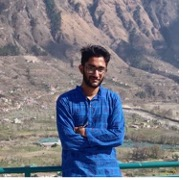
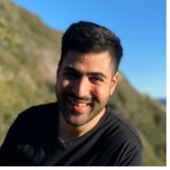

# Open Science (Opsci) Data Wallet

## 🌀 About

Data management with the Opsci Data Wallet flips the data economy on its head and gives data sovereignty back to the creators - research participants - and empowers researchers with tools for interoperability, sharing, and reproducible workflows.

## 💫 Inspiration

Neuroscience data is recorded from study participant’s brains using imaging technologies like Magnetic Resonance Imaging (MRI) and Electro-encephalography (EEG). This neuroimaging data is collected along with rich personal data, including age and health status, and metadata about experimental conditions and protocols.

These datasets are some of the most valuable in existence, in terms of the answers they contain about incurable diseases such as dementia, and human suffering such as depression and chronic pain. High quality neuroimaging data is collected over many years, through hundreds of scientist hours and time volunteered by participants. 

Currently, most of these datasets are siloed in centralised databases (e.g. universities and hospitals) all over the world. In some cases, data may be kept on personal hard drives. Unleashing this data to build a data commons for global scientists has been a difficult task.  Scientists are not incentivised to share their data open source with their peers, nor are participants incentivised to provide sensitive data. 

As a consequence, this valuable data is vulnerable to loss and corruption, scientific collaboration is difficult, and participants are hard to recruit. If participants do volunteer, they effectively give up ownership over their data because managing their consent and dataset permissions is a high friction and complex process.

## 💭 Concept

Opscientia’s vision is wield Web3 tools to:
- make it easy for neuroscientists to securely share data with their peers
- reward neuroscientists for sharing this data
- reward citizens for taking part in neuroscience studies and sharing their data
- allow citizens to retain ownership over their data and easily modify permissions (including with third parties, if they wish)


## 🕐 Weekend project overview

For the Web3 Weekend, we’ve focused on the first point above: enabling neuroscientists to securely share data with their peers.

User requirements:
- Simple secure user login using Metamask
- Frictionless drag-and-drop file sharing experience to secure data wallet hosted in Textile and IPFS
- Scientific 'kudos' using POAP
- Access Control Management of permissioned data 
- Automated data validation (data for solution to adhere to BRAIN IMAGING DATA STRUCTURE (BIDS) standard)

## Technology Stack

- React.js
- Next.js
- Textile DB
- IPFS
- POAP

## Hosting

Access the UI at: https://web3weekend-hackathon.vercel.app/

## Getting Started

First, install dependencies:
```bash
npm install
```

Next, run the development server:

```bash
npm run dev
# or
yarn dev
```

Open [http://localhost:3000](http://localhost:3000) with your browser to see the result.

## Meet the team

### Achintya Kumar, Software Engineer, Opscientia Open Web Fellowship


_"The transformative potential of IPFS for powering decentralized applications on Web 3.0 inspires me to consider how the internet can be made more inclusive, censorship-resistant, and empower the individual through self-sovereignty of personal data. I believe the decentralized web is approaching maturity for the widespread use and will soon transform various aspects of our life, making the world more open and at the same time upholding personal privacy!"_

### Alexandra McCarroll, Software & Data Engineer


_"Software engineer, data engineer, web3 evangelist, and experienced professional in traditional financial services both in London and Hong Kong. Currently exploring how we can make the world a fairer and freer place through the utilization of decentralized technologies, specifically data decentralization and data self-sovereignty."_

### Kinshuk Kashyap, Software Engineer, Google Summer of Code Fellow



_"I personally believe that in fields like neuroscience, where extremely large datasets are becoming the norm, decentralized storage will prove a key factor in open and easy access to data and consequently help accelerate research."_

### Sarah Hamburg, Ph.D., Neuroscientist


_"I spent my early life in academia before transitioning into tech. There’s an unnecessary gulf between the two which stifles innovation on both sides. I’m passionate about open and decentralised science to further knowledge generation, and participant involvement and empowerment."_

### Shady El Damaty, Ph.D., Neuroscientist



_"The most significant existential challenge for the future of science is human coordination and incentive alignment. What started as a brain hack-a-thon project has become a start-up to decentralize scientific enterprise and uplift the people that make knowledge generation possible."_

## Thanks!
